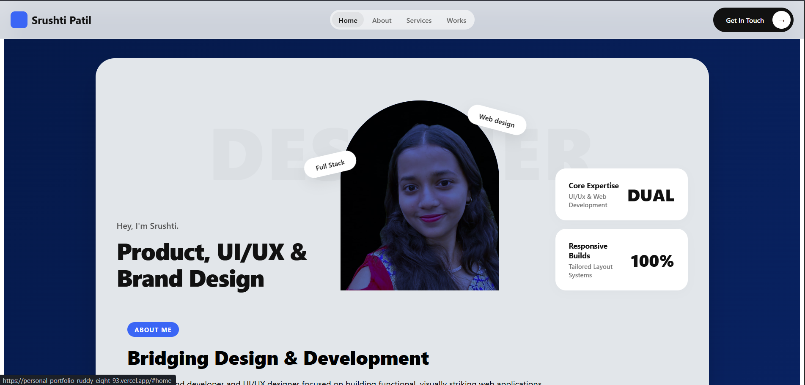
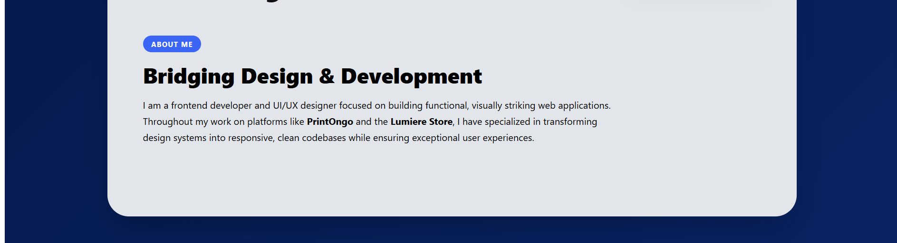
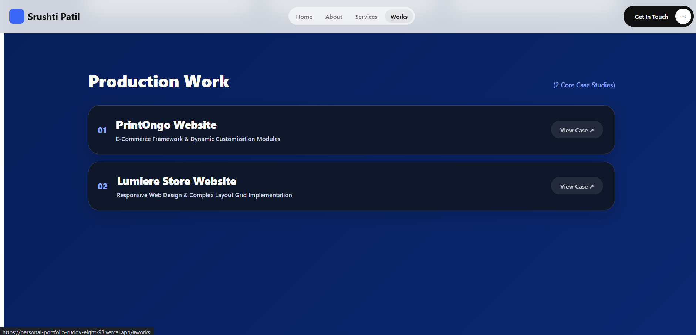

# 🌐 Srushti Patil – Personal Portfolio

A sleek, responsive, and performance-optimized personal portfolio built using **React** and **Vite**. This portfolio represents my journey as a **Frontend Developer** and **UI/UX Designer**, showcasing projects from concept to deployment with a strong focus on clean design, performance, and user experience.

---

## 🌍 Live Demo

🔗 **Portfolio:** https://personal-portfolio-ruddy-eight-93.vercel.app/

---

# 📸 Portfolio Preview

## 🏠 Home



---

## 👩‍💻 About



---

## 🚀 Selected Works



---


# ✨ Features

- 🎨 Modern and minimal UI
- ⚡ Built with React + Vite
- 📱 Fully responsive across all devices
- 🧭 Smooth scrolling navigation
- 🎯 Modular component architecture
- 💼 Dedicated project showcase
- 🖌️ UI/UX design section
- 💻 Frontend development section
- 📬 Contact section
- 🚀 Fast loading and optimized performance

---

# 🚀 Featured Platforms

### 🖨️ PrintOngo

A startup platform focused on simplifying printing services through an intuitive and responsive user experience.

### 💡 Lumiere Store

A modern responsive e-commerce website featuring clean layouts and an elegant shopping experience.

---

# 🛠 Tech Stack

| Category | Technologies |
|----------|--------------|
| Frontend | React |
| Build Tool | Vite |
| Styling | CSS3, Inline Style Objects |
| JavaScript | ES6+ |
| Navigation | Smooth Scroll |
| Deployment | GitHub Pages / Vercel |

---

# 📂 Project Structure

```
src/
├── components/
│   ├── Navbar.jsx
│   ├── Hero.jsx
│   ├── AboutIntro.jsx
│   ├── SelectedWorks.jsx
│   ├── Experience.jsx
│   ├── UiUxDesign.jsx
│   ├── BrandIdentity.jsx
│   ├── WebExperience.jsx
│   ├── Development.jsx
│   ├── ContactCta.jsx
│   └── Footer.jsx
│
├── App.jsx
└── main.jsx
```

---

# ⚙️ Installation

Clone the repository

```bash
git clone https://github.com/suskizzstack404/Personal-Portfolio.git
```

Navigate into the project

```bash
cd Personal-Portfolio
```

Install dependencies

```bash
npm install
```

Run the development server

```bash
npm run dev
```

Build for production

```bash
npm run build
```

Preview the production build

```bash
npm run preview
```

---

# 🎯 Design Philosophy

This portfolio was built with the following goals:

- Clean visual hierarchy
- Performance-first architecture
- Modular React components
- Responsive layouts
- Minimal animations
- Easy scalability
- Maintainable codebase

---

# 📈 Performance

- ⚡ Lightning-fast development with Vite
- 📱 Responsive on desktop, tablet, and mobile
- 🚀 Optimized React rendering
- 🎯 Modular component architecture
- ♿ Accessibility-focused layouts

---

# 📬 Contact

Feel free to connect with me!

- 💼 LinkedIn: https://www.linkedin.com/in/srushti-patil-126a03419/
- 📧 Email: srushtisarts@gmail.com
- 🌐 Portfolio: https://personal-portfolio-ruddy-eight-93.vercel.app/

---

# ⭐ Support

If you like this project, consider giving it a **⭐ Star** on GitHub.

It motivates me to keep building and sharing more projects.

---

## 📄 License

This project is licensed under the **MIT License**.

---

<div align="center">

### Made with ❤️ by Srushti Patil

**Frontend Developer • UI/UX Designer • React Developer**

</div>